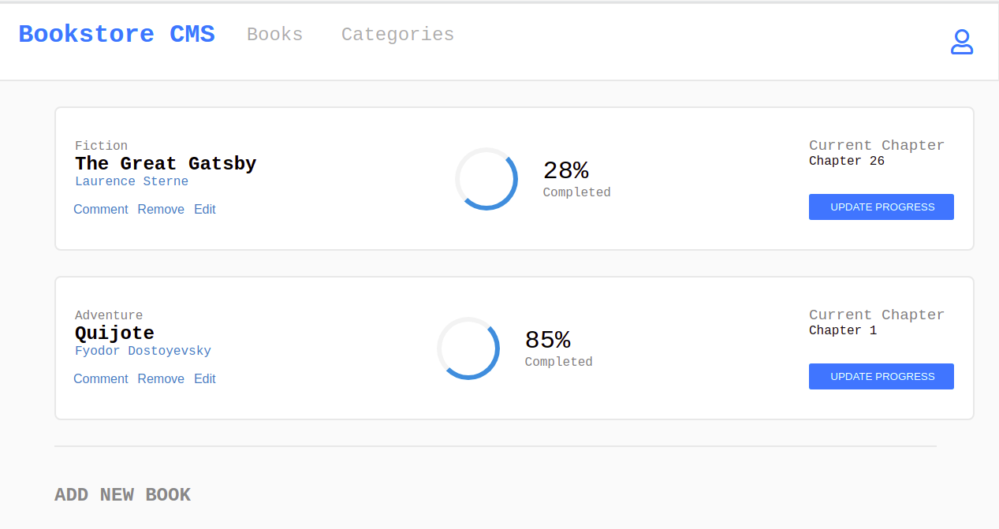

# Bookstore - Jose Abel Ramirez Frontany

The Bookstore is an MVP version of a website build with React and Redux, that consist in the following:

- Display a list of books.
- Allows to add a book.
- Allows to remove a selected book.

It has two subpages: "Books" and "Categories." However, it was only required to implement the "Books" part. The "Categories" page is empty for this MVP. The Bookstore MVP is connected with Axios to the API https://us-central1-bookstore-api-e63c8.cloudfunctions.net/bookstoreApi.



## Built With

- React
- React-dom
- Redux
- Thunk
- Axios
- Webpack
- Babel
- HTML
- CSS

## Getting Started

To get a local copy up and running follow these simple example steps.

### Setup

Go to the top of the page, press te green button that says "Code", and copy the link. Then you have to go to your console and type

```
    git clone 'repository-link'
```

That's all, you are ready to go!

### Install

Run the following command to have all yarn packages dependencies installed:

```
    yarn install
```

### Usage

To run the "react-scripts start" script, type the following command:

```
    npm start
```

### Linters

To run the Javascript linters type the following

```
    npx eslint .
```

To run the HTML linters type the following

```
    npx hint .

```

To run the CSS linters type the following

```
    npx stylelint "**/*.{css,scss}"
```

## Author: Jose Abel Ramirez Frontany\*\*

- GitHub: [Jose Abel Ramirez Frontany](https://github.com/jose-Abel)
- Linkedin: [Jose Abel Ramirez Frontany](https://www.linkedin.com/in/jose-abel-r-7674a842/)

## 🤝 Contributing

Contributions, issues, and feature requests are welcome!

## 📝 License

This project is MIT licensed.

## Show your support

Give a ⭐️ if you like this project!
